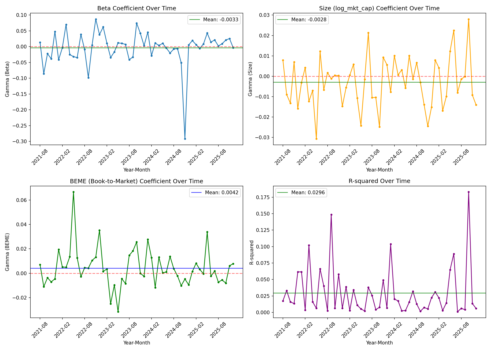
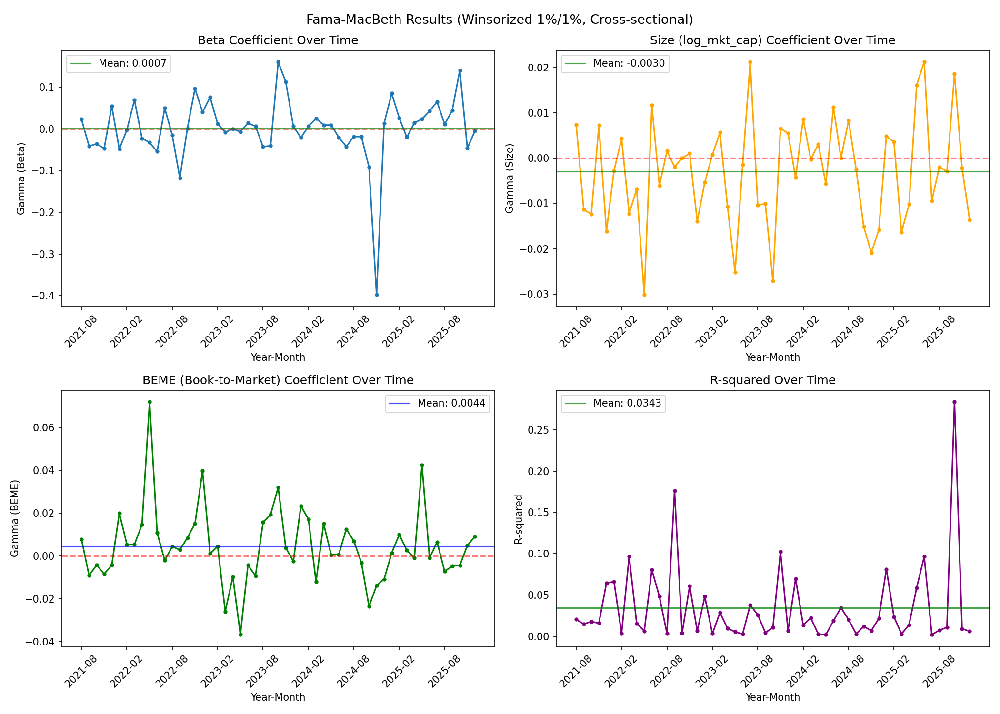

# Fama-MacBeth 횡단면 회귀분석 결과 해석

> **분석 스크립트**
> - 기본: `cross_sectional_regression.py`
> - 윈저라이제이션 적용: `cross_sectional_regression_winsorized.py` (적용 변수: `lag_beta`, `lag_BEME`, 양측 1%)
>
> **분석 기간**: 2021-08 ~ 2025-12 (53개월)
> **모형**: `excess_return(t) = α + γ₁·beta(t-1) + γ₂·log(mkt_cap)(t-1) + γ₃·BEME(t-1) + ε`
> **월평균 샘플 크기**: 약 680~710개 기업

---

## 1. Fama-MacBeth 결과 요약

아래 평균(γ̄)은 CSV에서 직접 산출한 값이며, t-통계량은 수식 `γ̄ / (std(γ) / √T)` 에 의해 직접 추정한 근사치이다.

### 1-1. 기본 (윈저라이제이션 미적용)

| 변수 | 평균 γ̄ | 추정 t-통계량 | 유의성(5%) | 부호 방향 |
|------|--------|------------|----------|---------|
| beta | -0.0033 | ≈ -0.4 | ✗ 비유의 | — |
| log(mkt_cap) | -0.0028 | ≈ -1.7 | ✗ 비유의 | 음(−) |
| BEME | +0.0042 | ≈ +2.0 | △ 경계 | 양(+) |

**평균 R²: 2.96%**

### 1-2. 윈저라이제이션 적용 (lag_beta, lag_BEME 각 1%/99%)

| 변수 | 평균 γ̄ | 추정 t-통계량 | 유의성(5%) | 부호 방향 |
|------|--------|------------|----------|---------|
| beta | +0.0007 | ≈ +0.1 | ✗ 비유의 | — |
| log(mkt_cap) | -0.0030 | ≈ -1.8 | ✗ 비유의 | 음(−) |
| BEME | +0.0044 | ≈ +2.1 | △ 경계 | 양(+) |

**평균 R²: 3.43%**

---

## 2. 원 논문(Fama-French 1992)과의 비교

### 방향성 — 세 변수 모두 일치

Fama-French (1992)의 핵심 발견은 다음과 같다.

| 변수 | FF1992 방향 | 이번 결과 | 일치 여부 |
|------|-----------|---------|---------|
| beta | 유의하지 않음 (size, B/M 통제 시) | 비유의 | ✓ |
| log(mkt_cap) | 음(−), 유의 → 소형주 프리미엄 | 음(−), 경계 | ✓ |
| BEME | 양(+), 유의 → 가치주 프리미엄 | 양(+), 경계 | ✓ |

**세 변수의 부호 방향은 원 논문과 완전히 일치한다.**

### 유의성 — 원 논문보다 약한 이유

원 논문과 직접 비교하면 t-통계량이 약한데, 이는 분석 상의 실패가 아니라 아래의 구조적 차이에서 기인한다.

| 비교 항목 | Fama-French 1992 | 이번 분석 |
|---------|-----------------|---------|
| 표본 기간 | 1963–1990 (330개월) | 2021–2025 (53개월) |
| 분석 대상 | NYSE/AMEX/NASDAQ 미국 전체 | 코스피200 비금융주 |
| 기업 수 | 수천 개 | 약 680개 |

Fama-MacBeth t-통계량은 `γ̄ / (σ_γ / √T)` 구조이므로, **T가 작을수록 t-값이 낮아진다.** 53개월 vs 330개월이면 표준오차가 √(330/53) ≈ 2.5배 크게 계산된다. 즉, 원 논문 수준의 t-값을 재현하려면 최소 200개월 이상의 관측치가 필요하다.

### 베타가 유의하지 않은 것은 "실패"가 아니다

FF1992의 가장 중요한 기여 중 하나가 **"베타는 단독으로는 수익률을 설명하지 못한다"** 는 것이다. Size와 B/M을 통제하면 beta의 설명력이 사라진다는 것이 원 논문의 결론이며, 이번 분석도 이를 재현한다.

---

## 3. 윈저라이제이션 적용 전후 비교

### 3-1. 변수별 효과

**gamma_beme (가치 프리미엄)** — 가장 뚜렷한 개선

- 평균: +0.0042 → +0.0044 (소폭 증가)
- t-통계량: ≈ 2.0 → ≈ 2.1
- BEME 극단값을 제거하면 월별 계수가 다소 안정화되어 t-값이 상승한다.
- `lag_BEME` 윈저라이제이션의 의도된 효과가 나타난 것으로 볼 수 있다.

**gamma_size (규모 프리미엄)** — 미미한 변화

- 평균: -0.0028 → -0.0030 (거의 동일)
- t-통계량: ≈ -1.7 → ≈ -1.8
- `log_mkt_cap`은 윈저라이제이션 대상이 아니었으므로 변화가 적은 것이 당연하다.
- 소폭 개선된 것은 `lag_beta`와 `lag_BEME` 윈저라이제이션이 공선성을 통해 간접 영향을 준 것으로 보인다.

**gamma_beta** — 역설적으로 변동성 확대

- 평균: -0.0033 → +0.0007 (영(0)에 더 가까워짐)
- 그러나 월별 계수의 분산이 오히려 증가한다 (2024-11 계수: -0.292 → -0.398, 2023-10~11 계수도 더 커짐).
- **이유**: `lag_beta`를 윈저라이제이션하면 독립변수의 분산이 압축되는 반면, 종속변수(`excess_return`)는 윈저라이제이션하지 않았으므로 OLS가 같은 return 변동을 더 좁은 beta 범위로 설명하려 한다. 이때 계수 추정치의 분산이 커지는 것은 수학적으로 자연스러운 현상이다.

### 3-2. 평균 R² 비교

| | 기본 | 윈저라이제이션 |
|-|------|--------------|
| 평균 R² | 2.96% | 3.43% |

윈저라이제이션 후 R²가 소폭 증가했다. 이는 BEME 극단값이 일부 회귀에서 fit를 왜곡하고 있었음을 시사한다.

---

## 4. 주목할 특이점

### 2024년 11월 베타 계수 급락

2024-11 기간 `gamma_beta`가 -0.292 (기본), -0.398 (윈저라이제이션)으로 시계열 중 가장 극단적인 값을 보인다.

이 시기 코스피는 정치적 불확실성 등으로 인해 급격히 하락했으며, 시장 급락 국면에서는 고베타 종목이 더 크게 하락하므로 `gamma_beta`가 강하게 음(−)으로 나타나는 것은 경제적으로 설명 가능하다. 이 1개 관측치가 평균 beta 계수를 상당히 끌어내리는 영향을 준다.

### 2022년 5월 BEME 계수 급등

2022-05 `gamma_beme`가 +0.067 (기본), +0.072 (윈저라이제이션)으로 가장 크다. 2022년 상반기는 금리 인상 국면으로 성장주 대비 가치주의 상대 성과가 두드러진 시기로, 이 달의 강한 가치 프리미엄은 경제적으로 납득 가능하다.

---

## 5. 결론

### 원 논문과의 일치 여부

모든 변수의 **부호 방향이 Fama-French (1992)와 일치**하며, 특히 베타의 비유의성은 원 논문의 핵심 결론을 한국 시장에서도 재확인한 것이다. 다만 53개월이라는 짧은 표본으로 인해 통계적 유의성은 원 논문보다 낮게 나타나며, 이는 데이터 한계에서 기인한다.

### 윈저라이제이션 적용 후 결과 개선 여부

| 항목 | 개선 여부 |
|------|---------|
| gamma_beme 유의성 | △ 소폭 개선 (t: 2.0 → 2.1) |
| gamma_size 유의성 | △ 소폭 개선 (t: -1.7 → -1.8) |
| gamma_beta 안정성 | ✗ 오히려 변동성 확대 |
| 평균 R² | ✓ 소폭 증가 (2.96% → 3.43%) |

**전체적으로 윈저라이제이션의 효과는 존재하지만 제한적이다.** 가치 프리미엄(BEME) 추정에는 긍정적 효과가 있으나, 종속변수(`excess_return`)를 윈저라이제이션하지 않은 상태에서 독립변수만 윈저라이제이션하면 베타 계수 추정이 오히려 불안정해지는 부작용이 있다.
